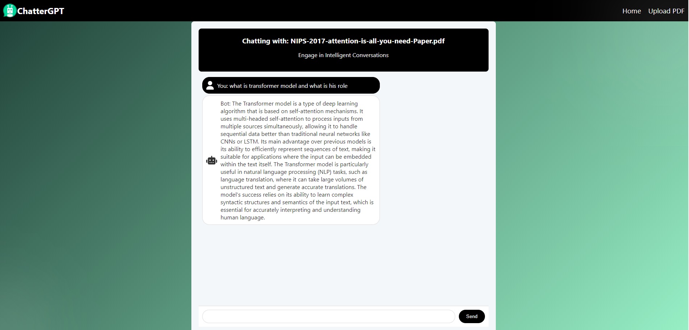

# Pdf-chatbot

A powerful tool to interact with your PDFs using intelligent conversations. Whether you're trying to extract insights from documents, perform advanced searches, or just need a fast way to analyze content, ChatterGPT makes it easy. Explore various features like keyword highlighting, summary generation, and interactive Q&A tailored to your specific document needs.

## What is Retrieval-Augmented Generation (RAG)?

RAG combines the strengths of retrieval-based and generation-based models. Instead of relying solely on pre-trained knowledge, RAG retrieves relevant information from an external source (like a document or a database) and uses it to generate more accurate and context-specific answers. This approach is particularly useful for tasks requiring domain-specific knowledge, such as interacting with PDFs to extract precise data and insights.

## Images and Interfaces

1. **Upload your pdf**

    

2. **Chat with your pdf**

    

3. **Chat with your pdf**

    

